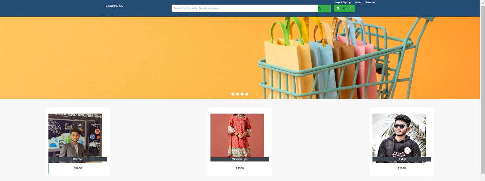
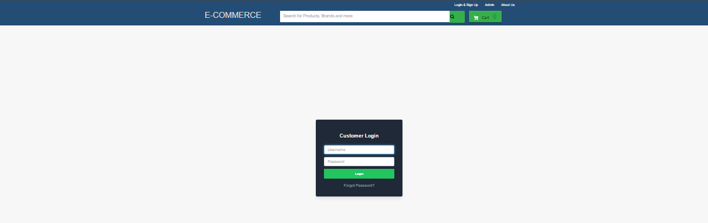
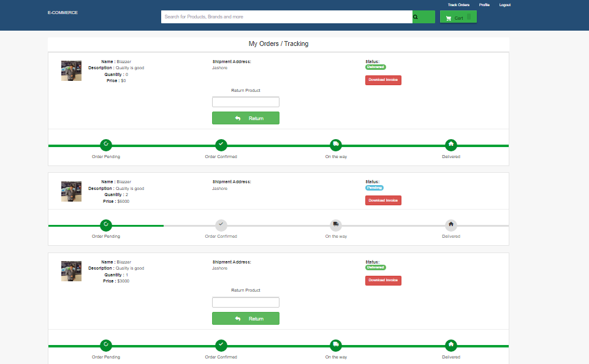
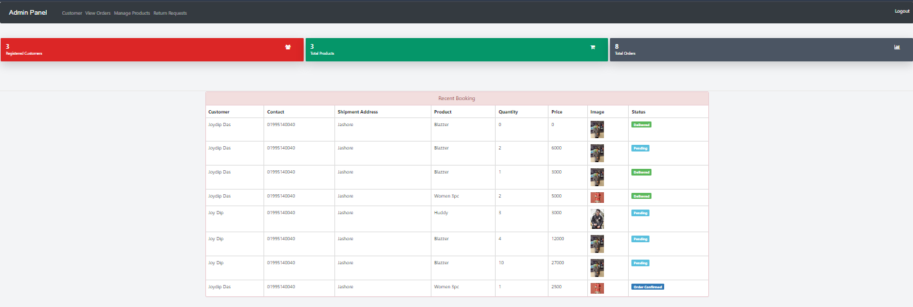

# Ecommerce Project Using Django Framework

### HomePage



### LogInPage



### OrderTracking



### AdminPannel



## Overview
This is a fully functional e-commerce web application built with Django, a high-level Python web framework. The project is suitable for university projects and includes key features for an online shopping platform. Users can browse products, add items to a shopping cart, and make purchases. An admin panel allows site administrators to manage products, customers, and orders efficiently.
The system is divided into two primary sections: the customer-facing side, where users can interact with the store, and the admin panel, where site administrators can manage orders and products.

## Key Features
User Registration and Login: Customers can create accounts to manage their orders and profile.
Product Browsing: Users can view available products along with details such as images, descriptions, and prices.
Shopping Cart: Customers can add items to their cart and adjust quantities before checkout.
Order Tracking: After placing an order, users can track their order status from their profile.
Admin Panel: The administrator can add new products, manage users, and process orders.
Payment Handling: Simple payment structure that collects necessary billing information from customers.
PDF Invoice: Customers can download a PDF invoice of their orders.

## Admin Panel Features
The admin panel provides full control over the management of the e-commerce site. Admins can:
Manage the product catalog, including adding, updating, and deleting products.
View, approve, and track customer orders.
Oversee customer records, including registered users, and update their details as necessary.
Access dashboards showing stats like total users, products, and orders.
## Order Management and Invoicing
The system includes an order management feature where every placed order initially appears as "pending." The admin can update the order status through various stages, such as "confirmed," "on the way," or "delivered," depending on the progress of the delivery.
Customers can download invoices for their orders, which contain detailed product and transaction information.


## File Stucrure

```shell
├── Ecommerce-WebApp (Current Directory)
    ├── ecom
    ├── ecommerce
    ├── templates
    ├── db.sqlite3
    ├── manage.py
    ├── requirements.txt
    └── static
        
```


## How to Install and Run this project?

### Installation
**1. Create a Folder where you want to save the project**

**2. Create a Virtual Environment and Activate**

Install Virtual Environment First
```
$  pip install virtualenv
```

Create Virtual Environment

For Windows
```
 python -m venv venv
```
For Mac
```
python3 -m venv venv
```

Activate Virtual Environment

For Windows
```
source venv/scripts/activate
```

For Mac
```
source venv/bin/activate
```

**3. Install Requirements from 'requirements.txt'**
```
pip install -r requirements.txt
```

**4. make database migrations**
```python
python manage.py migrate
```

**5. Login Credentials**

Create Super User 
```
$  python manage.py createsuperuser
```
Then Add Email, Username and Password

**6. Now Run Server**

Command for Windows:
```python
$ python manage.py runserver
```

Command for Mac:
```python
$ python3 manage.py runserver
```


## Contributing

Contributions are always welcome!


